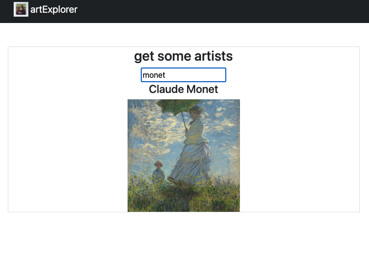

## artExplorer

> capstone project at devmtn



MVP: PERN full stack web app to find your favorite art, and save it in a list.

Features: encrypted login/register, postgres db, API calls to artsy and to database, CRUD functionality (comment on art pieces, save favorites)

Nice to have: assign rating to favorite artist/ art-pieces

## front end tech:

react, axios, bootstrap, jest (testing)

## back end tech:

nodemon, express, cors

Design: RESTful api

APIs used: [artsy](https://developers.artsy.net/)

### quick-start instructions:

```
git clone https://github.com/adnjoo/artexplorer
npm run client
```

in separate terminal window:

```
npm run server
```

### (jest) testing instructions:

```
cd client
npm run test
```
