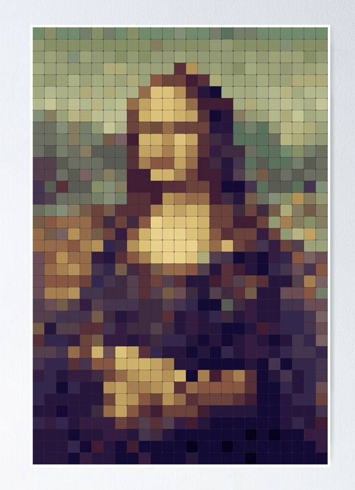

<!-- PROJECT LOGO -->
<br />
<p align="center">
  [https://artexplorer-1.netlify.app/]()
  <h3 align="center">Art Explorer</h3>
  <p align="center">
    This application allows you to find your favorite artists using the Artsy API
    <br />
    <br />
    <a href="https://artexplorer-1.netlify.app/">Try App</a>
    <br />
  </p>
</p>

<p align="center">
<a href='https://artexplorer-1.netlify.app/'>
<br>
</a>
</p>

<br>

### Features:

- Encrypted Login & Register
- API calls to Artsy and to database
- CRUD functionality
- Responsive application

### Technologies Used:

- React
- Axios
- Bootstrap
- Three.js
- Nodemon
- Postgres
- Express
- CORS
- [Artsy API](https://developers.artsy.net/)
- Jest

### Deployment:

- Front End [Netlify](https://artexplorer-1.netlify.app/)
- Back End [Heroku](https://protected-reaches-25441.herokuapp.com/)

### Quick-Start Instructions:

```
git clone https://github.com/adnjoo/artexplorer
cd artexplorer/client
npm install
npm start
```

Simultaneously:

```
cd server
npm install
npm start
```

### Run Tests:

```
npm test
```
