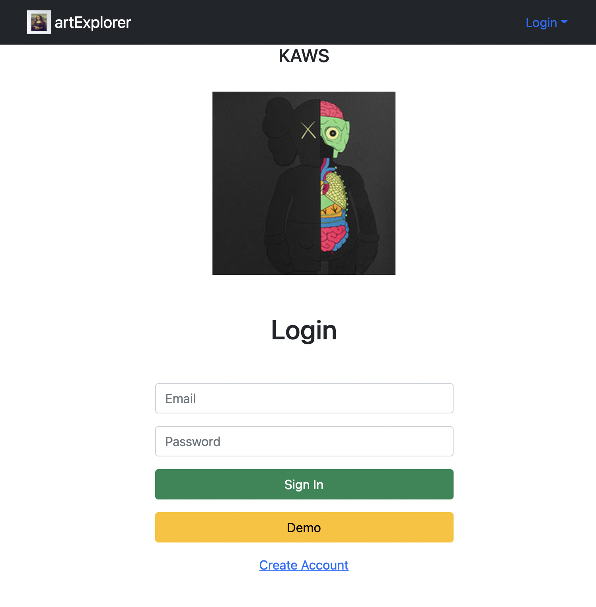

## artExplorer

> capstone project at devmtn



Description: full stack (PERN) web app to find your favorite artists using the artsy api.

### Features:

- encrypted login/register
- API calls to artsy and to db
- CRUD functionality (add fav artist, delete fav artist)

### Front end tech:

- react
- axios
- bootstrap
- jest

### Bells & whistles:

- three.js

### Back end tech:

- nodemon
- postgres
- express
- cors
- [artsy api](https://developers.artsy.net/)

### Deployment

- front end [netlify](https://artexplorer-1.netlify.app/)
- back end [heroku](https://protected-reaches-25441.herokuapp.com/)

### Quick-start instructions:

```
git clone https://github.com/adnjoo/artexplorer
cd artexplorer
npm run dev
```

### Run tests:

```
npm test
```
